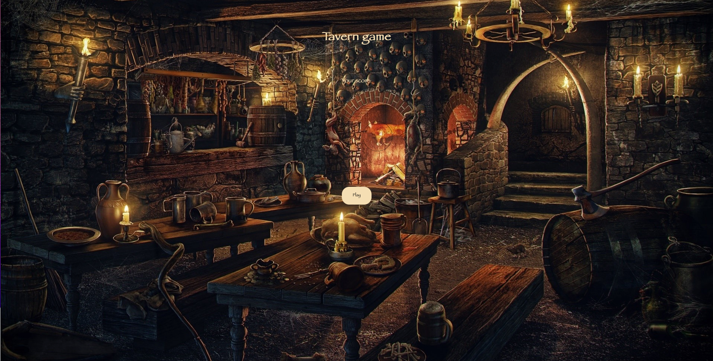

# Tavern game

basic speedgame made for fun

_still needs to be finished_

# Technologies used

### Built with:

- Vanilla JS
- HTML
- CSS

# Setup and usage

### Start game

Press "Play" button to start the game, music will go on and beer mugs start to popping up

### End game

- Game ends when you hit the "Stop" button
- Game ends when you hit the wrong circle
- Game ends when beer pops up 10 times

[**Game link**](https://public.bc.fi/s2300108/speedgame/)

# Screenshot

# Sources

background image: [**source**](https://rare-gallery.com/838466-tavern-the-witcher-3-wild-hunt-men.html)

music used:

- **Witcher 3 Wild Hunt OST "Drink Up, There's More!"**
- **Witcher 3 Wild Hunt OST "The Nightingale"**

non-commercial, non-altered usage
Cypyright, All rights belongs to CD Projekt RED

# Authors and acknowledgement

Ivan Pudin
